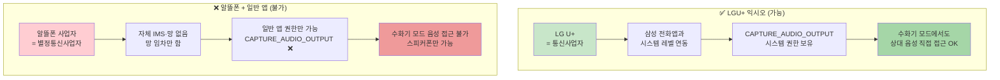
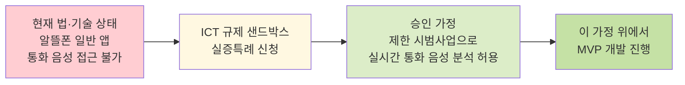
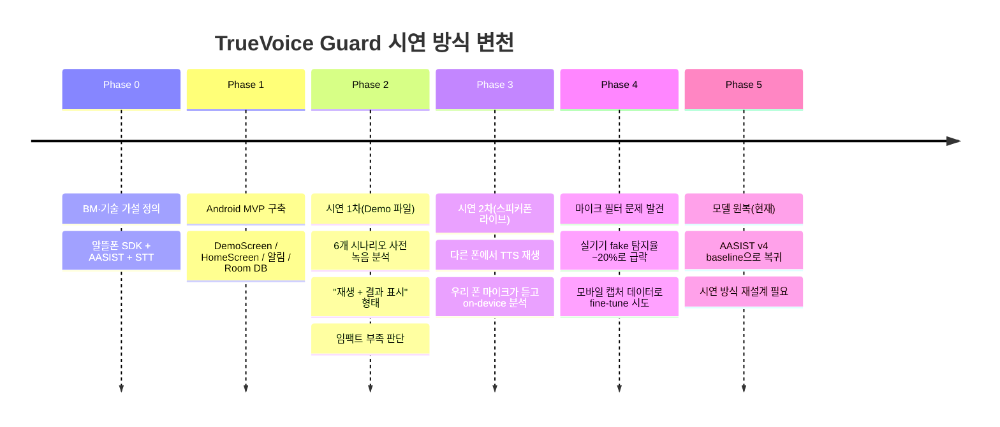
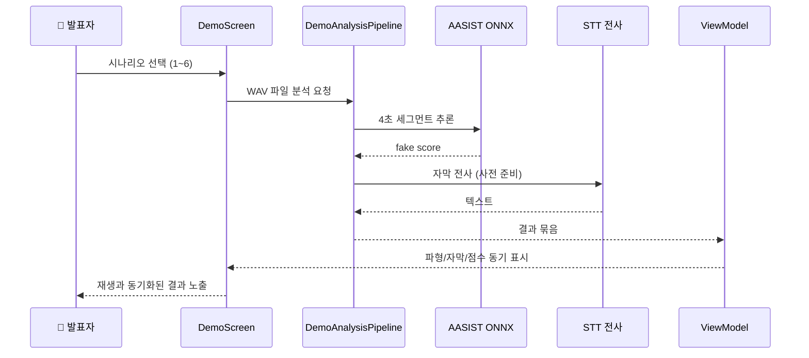
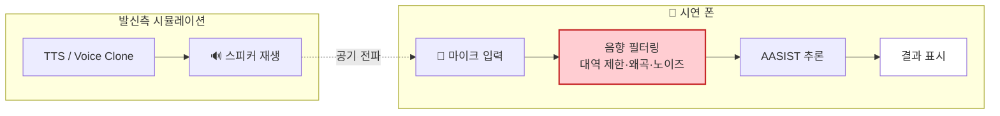
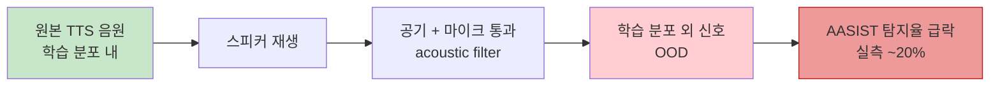
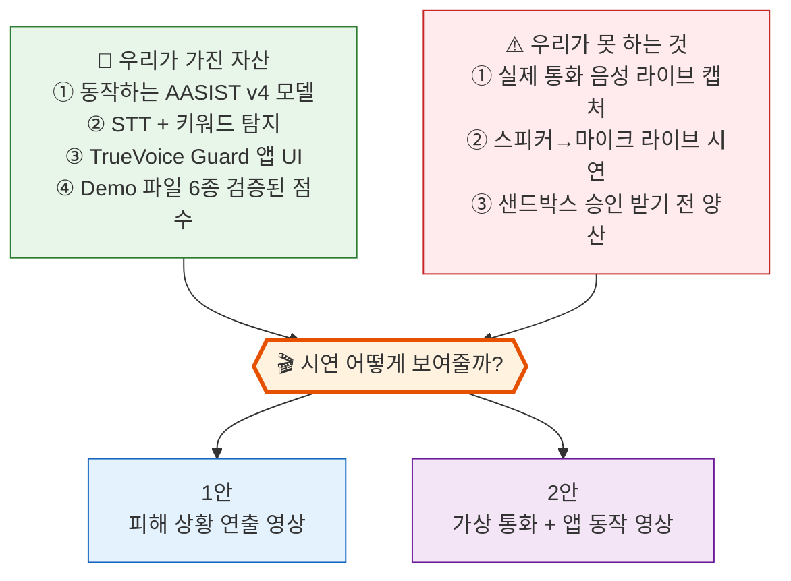
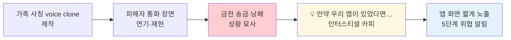
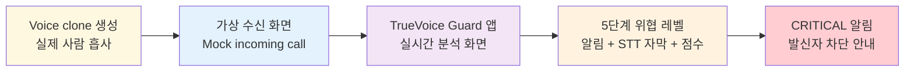

## 0. 한 장 요약 (TL;DR)

```mermaid
flowchart LR
    A["💡 BM 가설<br/>알뜰폰용 실시간<br/>딥보이스 탐지"] --> B["🧱 규제·기술 벽<br/>통신3사·삼성만<br/>통화음성 접근"]
    B --> C["📜 우회 전략<br/>규제 샌드박스<br/>가정"]
    C --> D["📱 MVP 개발<br/>AASIST + STT<br/>Android 앱"]
    D --> E1["🎬 시연 1차<br/>Demo 파일 재생<br/>+ STT + 탐지"]
    E1 -.시연 임팩트 부족.-> E2["🎤 시연 2차<br/>스피커폰→마이크<br/>on-device"]
    E2 -.마이크 필터로<br/>탐지율 급락.-> F["🔁 모델 원복<br/>+ 시연 방식<br/>재설계 필요"]
    F --> G{{"❓ 의사결정 필요<br/>1안 vs 2안"}}

    style A fill:#e3f2fd,stroke:#1565c0
    style B fill:#ffebee,stroke:#c62828
    style C fill:#fff8e1,stroke:#f9a825
    style D fill:#e8f5e9,stroke:#2e7d32
    style E1 fill:#f3e5f5,stroke:#6a1b9a
    style E2 fill:#f3e5f5,stroke:#6a1b9a
    style F fill:#fce4ec,stroke:#ad1457
    style G fill:#fff3e0,stroke:#e65100,stroke-width:3px
```

| 핵심 메시지 | 한 줄 |
|---|---|
| **우리가 풀려는 문제** | 알뜰폰 사용자도 보이스피싱 + 딥보이스 동시 보호받게 만들기 |
| **막힌 지점** | "실시간 통화 음성 직접 접근"은 통신3사·OEM만 합법/기술적으로 가능 |
| **우회 가정** | 규제 샌드박스 신청·승인을 전제로 PoC 진행 ([Notion 참조](https://www.notion.so/AIMBA6-31ca85c6667c809baf24daf4a84413a2)) |
| **시연 시도 1** | Demo 음원 재생 + STT 자막 + Fake Voice 점수 → 임팩트 부족 |
| **시연 시도 2** | 스피커폰 + 마이크로 라이브 분석 → **마이크 acoustic filter** 때문에 탐지율 급락 |
| **현재 상태** | AASIST 모델 원복 완료. 시연 시나리오 재설계 필요 |
| **결정 필요** | **1안: 피해 상황 영상** vs **2안: 가상 통화 + 앱 동작 영상** |

---

## 1. 본 시작 — 비즈니스 모델 가설

### 1.1 기술적 차별점 (계획)

- **AASIST-L** on-device 딥보이스 탐지 (107K params, 644KB ONNX)
- **Korean STT + 200+ 키워드 사전**으로 보이스피싱 키워드 동시 탐지
- 두 신호를 **CombinedThreatAggregator**가 결합해 **5단계 통합 위협 레벨** 산출
- 알뜰폰 사업자에 **SDK 형태 B2B 납품**

---

## 2. 부딪힌 벽 — "왜 우리는 익시오처럼 못 하는가"

### 2.1 익시오가 가능한 이유 ≠ 우리가 가능한 이유

### 2.2 법·기술 이중 차단

| 차원 | 차단 근거 |
|---|---|
| **법률** | 통신비밀보호법 제3조 — "누구든지 이 법에 의하지 아니하고는 전기통신의 감청을 하지 못한다." 상업적 통화 음성 분석은 원칙적으로 감청에 해당 |
| **기술** | Android OS는 `CAPTURE_AUDIO_OUTPUT`을 시스템 앱(OEM·정부 협력)에만 부여. 일반 앱은 통화 다운링크 직접 캡처 불가 |
| **사업자 지위** | 알뜰폰은 전기통신사업법상 **별정통신사업자** — 자체 통신설비가 없어 네트워크 레벨에서도 음성 접근 불가 |

> 결론: **일반 앱이 일반 단말 위에서 수화기 모드 통화 음성에 접근하는 길은 현재 닫혀 있다.**

---

## 3. 우리의 우회 전략 — 규제 샌드박스 가정

- **참고**: 위 경로 검토 및 신청 가능성은 [Notion 문서](https://www.notion.so/AIMBA6-31ca85c6667c809baf24daf4a84413a2) 하위 페이지에 정리.
- **본 프랙티컴의 PoC는 이 가정 위에서 진행됨.**
- 시연·발표 시에도 "샌드박스 통과를 전제로 한 가까운 미래 PoC"라는 점을 명시할 필요.

---

## 4. MVP 개발 여정 — 두 번의 시연 피벗

### 4.1 시연 1차 — Demo 파일 재생 방식

**구성:** `DemoScreen` 에서 사전 녹음된 6개 시나리오를 순차 재생하며, 같은 음원에 AASIST + STT 키워드 탐지를 적용해 결과를 표시.

**검증된 점수 (현재 baseline):**

| 시나리오 | 평균 fake score | 최대 | 판정 |
|---|---:|---:|---|
| demo_01 일상 통화 | 0.240 | 0.645 | 🟢 SAFE |
| demo_02 TTS 일상 대화 | 0.994 | 1.000 | 🔴 DANGER |
| demo_03 실제 사람 피싱 | 0.017 | 0.036 | 🟢 SAFE (딥보이스 기준) |
| demo_04 TTS 피싱 | 0.985 | 1.000 | 🔴 DANGER |
| demo_05 은행 정상 안내 | 0.011 | 0.046 | 🟢 SAFE |
| demo_06 보험 사기 (사람) | 0.042 | 0.217 | 🟢 SAFE (딥보이스 기준) |

**한계 인식:**
- 시연 시 "녹음된 파일을 분석" → 현장감·임팩트 부족
- "실제 통화처럼 보이는" 시연이 필요하다는 판단

---

### 4.2 시연 2차 — 스피커폰 + 마이크 라이브 방식

**구성:** 다른 폰(또는 PC 스피커)에서 클로닝/TTS 음성을 재생하고, 시연 폰의 마이크로 들어와 on-device에서 실시간 분석.

**문제 발견:**

| 측정 대상 | 결과 |
|---|---|
| Python 직접 파일 분석 (TTS) | **100%** 탐지 |
| 모바일 캡처 fake 445개 파이썬 홀드아웃 | **56%** 탐지 |
| 실기기 시연 환경 (Xcover 5) | **~20%** 탐지 |

**시도한 보정:**
- iPhone 녹음 real 878개 + 모바일 캡처 fake 445개로 fine-tune (v4)
- → 한국어 real 오탐은 33% → 0%로 잡았으나 스피커→마이크 fake 탐지는 여전히 미흡
- → **acoustic augmentation 데이터가 훨씬 더 필요한 것으로 결론**

**조치:**
- AASIST 모델은 **v4 baseline으로 원복** (`a257e59 fix(demo): stabilize TrueVoice model baseline`)
- 시연 방식 자체를 재설계해야 한다는 결론

---

## 5. 현재 난관 — 의사결정이 필요한 지점

---

## 6. 시연 1안 vs 2안 비교

### 6.1 1안 — "현실의 피해 상황을 보여주는" 사회적 영상

> Clone voice 기반 보이스피싱 피해를 드라마처럼 연출 → 서비스 필요성 강조

| 항목 | 평가 |
|---|---|
| **장점** | 감정 임팩트 큼 / 비즈니스 문제(시장 사각지대) 직관적 / 기술 한계 우회 가능 |
| **단점** | 기술 PoC 면에서 약함 / "그래서 너희가 만든 게 뭔데?"에 답이 약함 / 영상 제작·연기 리소스 필요 |
| **신뢰성 리스크** | "탐지 가능했다"는 주장이 영상 안에서만 성립 — 심사위원이 검증하기 어려움 |
| **제작 난이도** | 중상 (스토리보드, 출연자, 편집) |

---

### 6.2 2안 — "가상 통화 + 앱 동작" 시연 영상

> 실제 fake voice는 우리가 만들고, 가상 수신 화면 + TrueVoice Guard 앱 화면을 합성해 "전화가 오면 실제로 이렇게 동작합니다" 시연

| 항목 | 평가 |
|---|---|
| **장점** | 우리 앱 동작이 직접 노출 / 기술 PoC 메시지 명확 / Demo 파일 분석 결과를 그대로 활용 가능 |
| **단점** | "실제 통화 라이브 아님" 명시 필요 / 영상 합성 연출이 어색하면 신뢰 떨어짐 |
| **신뢰성 리스크** | 라이브 캡처가 아님이 드러나면 PoC로서 약점 — 그러나 "샌드박스 승인 후 가능"이라는 가정 명시로 보완 가능 |
| **제작 난이도** | 중 (앱 화면 녹화 + voice clone + 화면 합성) |
