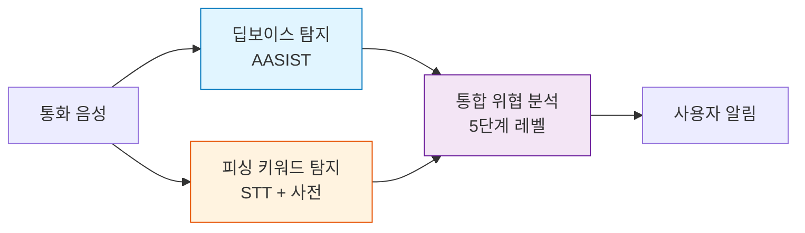
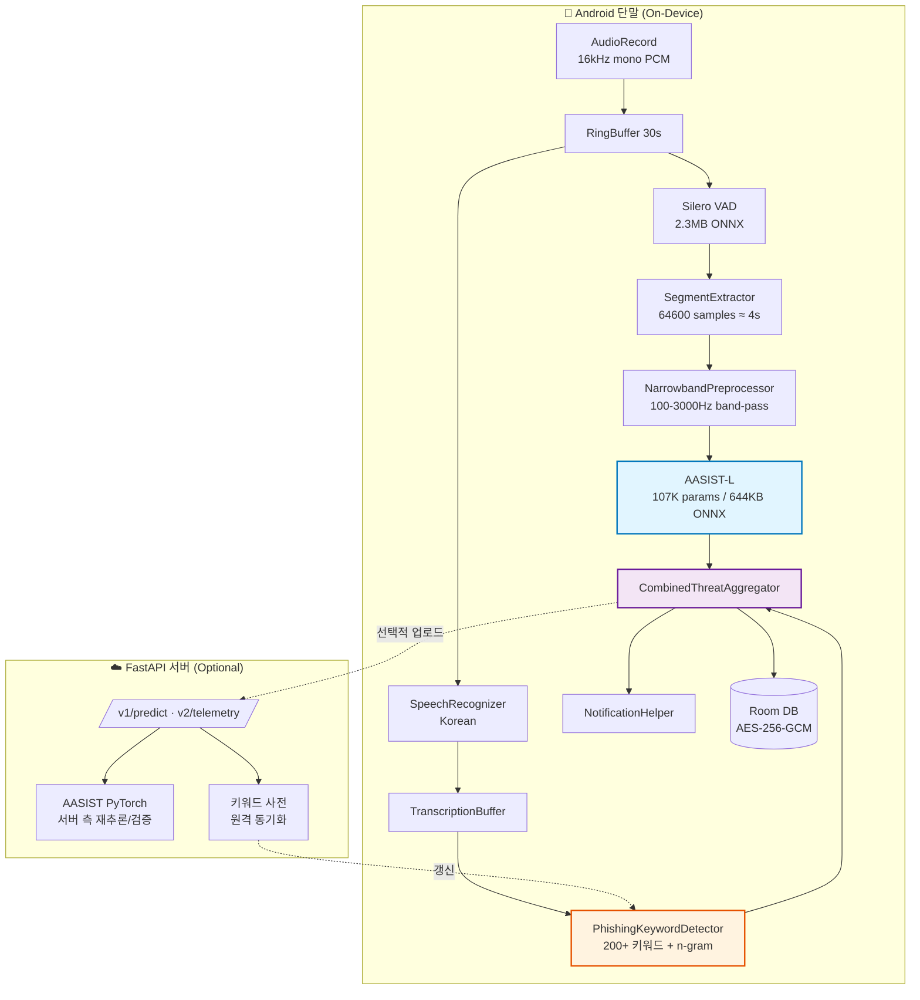
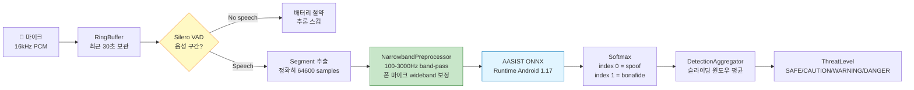
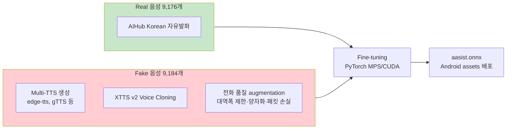
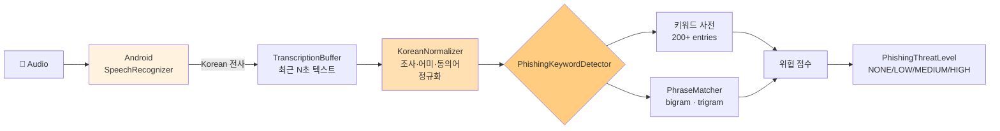
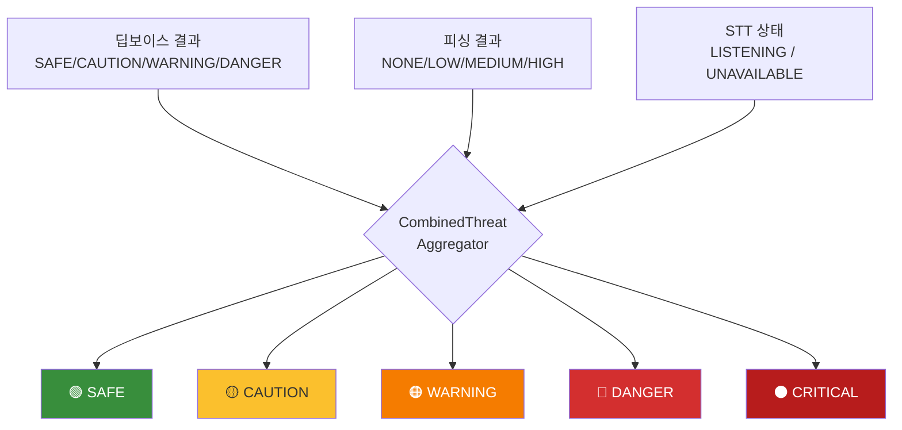
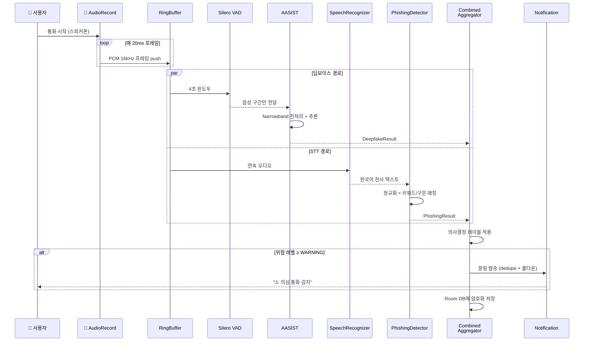
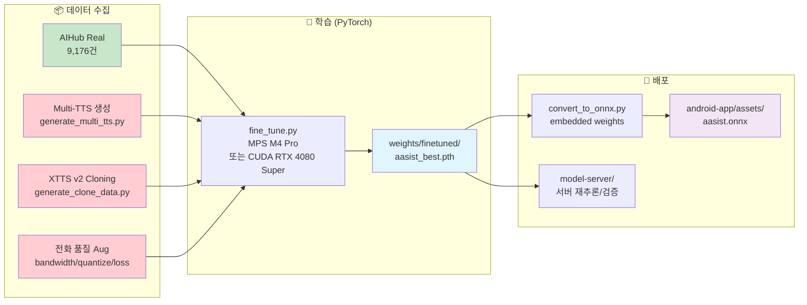
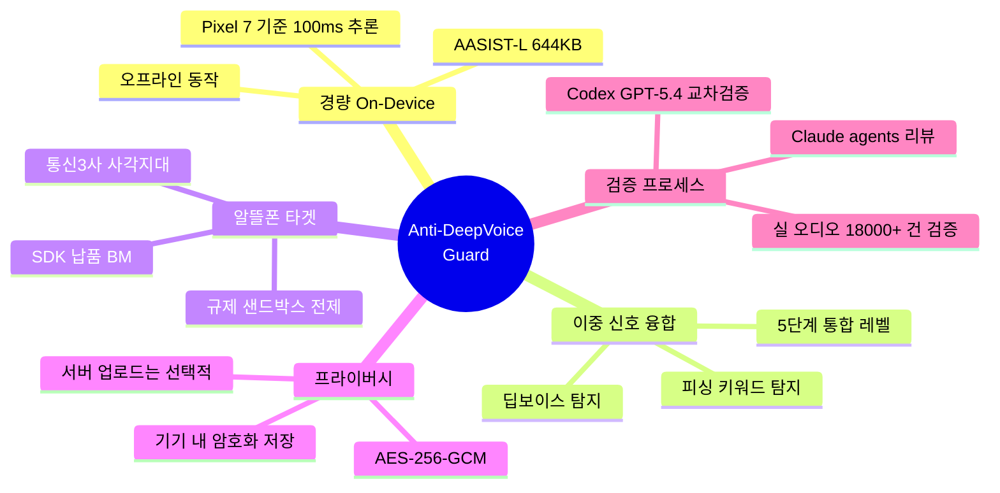
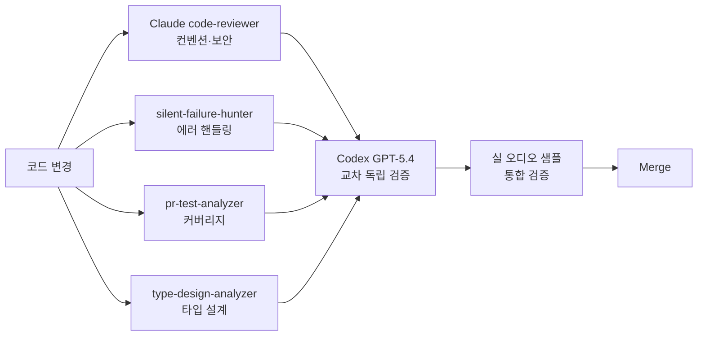

# Anti-DeepVoice Guard — 프로젝트 개요

> **한 줄 요약**: 알뜰폰 사용자를 위한 **실시간 보이스피싱 + Deepfake 음성 동시 탐지** Android 앱.
> AASIST 딥러닝 모델(on-device)로 AI 합성 음성을 식별하고, Korean STT + 키워드 사전으로 피싱 문구를 함께 분석해 **통합 위협 레벨**을 사용자에게 알림.

---

## 1. 문제 정의 — 왜 만들었는가

### 배경
- **Deepfake 음성 기술**의 발전으로 가족·지인을 사칭한 보이스피싱이 증가 중.
- 통신 3사(SKT/KT/LGU+)는 자체 보이스피싱 차단 서비스를 운영하나, **알뜰폰 사용자는 사각지대**.
- 삼성 Galaxy S26부터 보이스피싱 방지 기능이 탑재되지만, **딥보이스(AI 합성 음성) 탐지는 미포함**.

### 우리의 접근
**두 개의 독립된 탐지 축을 결합**해 보완적 신호를 얻는다.



| 단일 신호의 한계 | 결합 시 효과 |
|---|---|
| 딥보이스 단독: 실제 사람이 피싱하면 놓침 | AI 음성이 아니더라도 피싱 문구로 탐지 |
| 키워드 단독: 피싱 단어를 쓰지 않는 정교한 대본 대응 불가 | AI 음성이라는 사실 자체가 강력한 경고 신호 |
| **둘 다 탐지되면 = CRITICAL** (최고 경고) | False Positive 감소, 확신도 상승 |

---

## 2. 전체 시스템 아키텍처

### 2.1 컴포넌트 수준 (Bird's-eye view)



### 2.2 레포지토리 구조

```
anti-deepvoice-guard/
├── android-app/          ← Kotlin + Jetpack Compose (메인 산출물)
├── model-training/       ← PyTorch 학습, ONNX 변환 파이프라인
├── model-server/         ← FastAPI 서버 (하이브리드 옵션)
├── test-samples/         ← 검증용 오디오 (real / fake / fake-diverse / Demo)
├── tools/                ← 오디오 전처리, TTS 생성, 스코어링 스크립트
└── docs/                 ← 문서 (본 문서 포함)
```

---

## 3. 🔵 Deepvoice 탐지 관점 (AASIST)

### 3.1 모델 선정 이유
**AASIST** (Audio Anti-Spoofing using Integrated Spectro-Temporal Graph Attention Networks, ICASSP 2022)

- **Raw waveform 입력** — MFCC/spectrogram 수작업 feature 없이 end-to-end.
- **Graph Attention** — 시간(temporal) × 주파수(spectral) 두 축의 그래프 attention을 통합.
- **경량화** — AASIST-L 버전은 파라미터 **107K**, ONNX 파일 **644KB** → 단말 추론 가능.

### 3.2 On-Device 추론 파이프라인



### 3.3 핵심 설계 결정

| 결정 | 이유 |
|---|---|
| **2단계 파이프라인 (VAD → AASIST)** | VAD가 무음·노이즈 구간을 먼저 걸러내 AASIST 호출 횟수 ↓ → 배터리 효율 |
| **NarrowbandPreprocessor (신규 도입)** | 폰 마이크는 wideband(~8kHz) 신호를 수집하나, AASIST 학습 분포는 narrowband(전화 품질). 전처리 없이 입력하면 **real voice를 FAKE로 오판**. 100-3000Hz band-pass로 도메인 매칭. |
| **Room DB + AES-256-GCM** | 탐지 이력을 기기 내부에만 저장, 암호화. 프라이버시 보호. |
| **audioSnapshot 원자 결합** | 탐지 이벤트와 증거 audio를 emit 시점에 한 묶음으로 저장 → STT 지연으로 인한 시간 drift 방지 |

### 3.4 학습 데이터 & 성능



| 테스트 | 정확도 |
|---|---|
| Real WAV | **100%** (3/3) |
| Real MP3 | **100%** (10/10) |
| Fake 기본 | **100%** (4/4) |
| Fake 다양한 TTS | **94%** (16/17) |
| **종합** | **97%** (33/34) · val_acc 92.95% |
| **추론 latency** | **~100ms** per 4초 세그먼트 (Pixel 7) |

---

## 4. 🟠 STT 기반 보이스피싱 키워드 탐지

### 4.1 왜 별도 축인가
- Deepfake 탐지만으로는 **실제 사람이 대본을 읽는 피싱**을 잡지 못함.
- 한국어 보이스피싱은 **패턴화된 어휘·구문**을 반복 사용 → 키워드 사전 + n-gram 매칭으로 효과적 탐지.

### 4.2 탐지 파이프라인



### 4.3 구성 요소

| Component | 역할 |
|---|---|
| `SttCapabilityChecker` | 기기에 한국어 STT가 가능한지 사전 검증 (capability-gated) |
| `GoogleSttEngine` | Android SpeechRecognizer 래퍼, 연속 전사 |
| `TranscriptionBuffer` | 시간-정렬 전사 버퍼 (최근 발화 유지) |
| `KoreanNormalizer` | "수사관입니다" ↔ "수사관이에요" 등 어미 변형 흡수 |
| `PhishingKeywordDictionary` | 카테고리별 200+ 키워드 (검찰/금감원/대출/계좌이체 등) |
| `PhraseMatcher` | bigram/trigram 구문 매칭 — "계좌가 연루", "보안 카드 번호" 등 |
| `PhishingKeywordDetector` | 점수 합산 + 임계값 기반 `PhishingThreatLevel` 산출 |

### 4.4 성능
- 정상 금융 대화 10건 + 피싱 대본 15건 테스트 → **F1 > 0.75** 보장 (`PhishingKeywordDetectorTest`).

---

## 5. 🟣 통합 위협 분석 (CombinedThreatAggregator)

### 5.1 의사결정 테이블
두 채널의 결과를 **독립적으로 산출한 뒤 결합**.



### 5.2 결합 규칙 (주요 행)

| 딥보이스 | 피싱 | STT | 통합 결과 |
|---|---|---|---|
| DANGER | High | OK | **⚫ CRITICAL** ← AI + 피싱 양쪽 확증 |
| DANGER | Low/None | OK | 🔴 DANGER |
| DANGER | — | 불가 | 🔴 DANGER (딥보이스만 적용) |
| WARNING | High | OK | 🔴 DANGER (상향) |
| SAFE | High | OK | 🟠 WARNING |
| SAFE | Medium/Low | OK | 🟡 CAUTION |
| SAFE | None | OK | 🟢 SAFE |

> 실제 구현: `android-app/.../inference/CombinedThreatAggregator.kt` (13행 decision table)

---

## 6. 실시간 데이터 플로우 (Sequence)



---

## 7. 모델 학습 & 배포 파이프라인



---

## 8. 기술 스택 요약

| Layer | Technology |
|---|---|
| **AI 모델** | AASIST-L (107K params, 644KB ONNX) |
| **VAD** | Silero VAD v5 (2.3MB ONNX) |
| **STT** | Android SpeechRecognizer (Korean) |
| **피싱 탐지** | 200+ 키워드 사전 + bigram/trigram + 한국어 정규화 |
| **Android** | Kotlin · Jetpack Compose · Material3 · Hilt · Room |
| **Inference** | ONNX Runtime Android 1.17 |
| **Storage** | Room DB v3 + AES-256-GCM EncryptedFile |
| **Server** | FastAPI + PyTorch |
| **학습 환경** | M4 Pro 24GB (MPS) · RTX 4080 Super (CUDA) |

---

## 9. 프로젝트의 차별점



| 구분 | 기존 솔루션 | Anti-DeepVoice Guard |
|---|---|---|
| 대상 사용자 | 통신3사 가입자 | **알뜰폰 포함 전 Android 사용자** |
| 딥보이스 탐지 | ❌ 없음 (Galaxy S26 포함) | ✅ AASIST on-device |
| 피싱 키워드 탐지 | 부분 지원 | ✅ STT + 200+ 키워드 + n-gram |
| 배포 형태 | OEM 번들 | **SDK 형태, 알뜰폰 사업자 B2B** |
| 추론 위치 | 일부 서버 의존 | **On-device 우선, 서버는 옵션** |

---

## 10. 현재 상태 & 한계

### ✅ 완료
- AASIST v4 fine-tuning (val_acc 92.95%, 전체 97%)
- Android 앱 라이브 마이크 파이프라인 + Demo 시나리오 6종
- 통합 위협 레벨 13행 의사결정 테이블
- Room DB + 암호화 저장, 알림 dedupe/쿨다운
- Narrowband 도메인 매칭 전처리
- FastAPI 서버 v1/v2 API, 테스트 커버리지

### ⚠️ 알려진 한계
| 항목 | 내용 |
|---|---|
| **Android 10+ 통화 캡처 제약** | 상대방 음성 직접 캡처 불가 (VOICE_CALL/VOICE_DOWNLINK 차단) → **스피커폰 모드**에서만 양쪽 음성 수집 가능 |
| **에뮬레이터 마이크 문제** | Apple Silicon Mac + Android 에뮬레이터는 호스트 마이크 라우팅 이슈 → 라이브 테스트는 **실기기 필수** |
| **edge_ko_injoon TTS 오탐** | 특정 TTS 엔진에서 아직 탐지율 낮음 (21%) — 추가 학습 데이터로 개선 중 |

### 🎯 프랙티컴 경진대회 시연 방식
1. **Demo 탭** — 사전 녹음된 6개 시나리오 파일로 에뮬레이터에서 확실한 데모
2. **실기기 라이브** — USB 연결 실 Android 폰에서 스피커폰으로 다른 폰의 피싱 대본 재생 → 실시간 CRITICAL 알림
3. **사업 가정** — 실시간 통화 감지는 **알뜰폰 사업자가 규제 샌드박스를 통해 구현하는 방향**을 전제로 PoC

---

## 11. 검증 프로세스

모든 주요 변경은 **다중 AI 에이전트 교차 검증**을 거침:



---

## 부록 — 관련 문서

- **[README.md](../README.md)** — 빠른 시작 가이드
- **[docs/DEMO_TESTING_GUIDE.md](DEMO_TESTING_GUIDE.md)** — Demo 시나리오 시연 방법
- **[docs/REAL_DEVICE_TESTING.md](REAL_DEVICE_TESTING.md)** — 실기기 테스트 가이드
- **[ISSUE_SUMMARY_20260404.md](../ISSUE_SUMMARY_20260404.md)** — 법률/기술 이슈 요약
- **[ISSUE_SUMMARY_20260406.md](../ISSUE_SUMMARY_20260406.md)** — 비즈니스/기술 이슈 요약
- **AASIST 원 논문** — Jung et al., *"AASIST: Audio Anti-Spoofing using Integrated Spectro-Temporal Graph Attention Networks"*, ICASSP 2022

---

_작성 일자: 2026-04-19 · 프랙티컴 경진대회 출품작_
